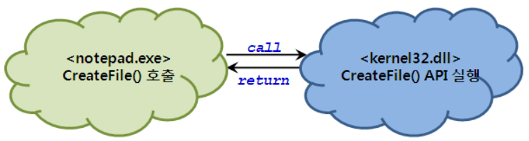
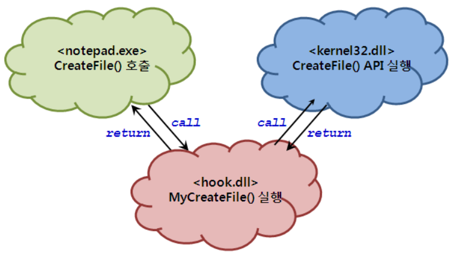

---

layout : single
title:  "Hooking"
excerpt: "Hooking 개념과 API hooking 실습"

categories:
  - Blog
tags:
  - [Windows]

toc: true
toc_sticky: true

date: 2021-03-03
last_modified_at: 2021-03-05
---
<!--
5주차 과제는 "Hooking 기초" 입니다.
원래는 Windows 데스크톱 앱에 대해 이해시킨 뒤에
    1. 간단한 DirectX 프로그램을 만들어 실행
    2. 해당 프로세스의 특정 DirectX 함수를 런타임에 Hooking 하여
        2-1) 화면 출력을 임의로 바꿈
        2-2) Discord나 Xbox Game Bar같은 In-game overlay 프로그램처럼 특정 프로세스의 화면 위에 UI를 그림
위와 같은 과제를 드리려고 했는데, 당장 DirectX API Hooking을 진행하기에는 난이도 상승 폭도 비교적 크고 시간 소모도 클 것 같더라구요.
그래서 세 단계 (Hooking 기초, 런타임 API Hooking 수행, 런타임 DirectX API Hooking 수행)로 나누어 차례 차례 진행해보려고 합니다.
- [필수 1] Hooking의 정의, 개념 등을 이해합니다. (Link 1)
- [필수 2] 모든 프로세스를 열거합니다. (콘솔 프로그램도 무관. Link 2, 3)
- [필수 3] 지정한 프로세스의 메모리에서 특정 주소의 데이터를 읽거나 원하는 데이터를 덮어씁니다. (Link 4, 5, 6)
- [선택 1] 직접 작성한 프로그램의 실행 흐름을 런타임 API Hooking을 이용하여 바꿔봅니다.
- [선택 2] Hooking 여부를 탐지할 수 있는 방법들을 생각하고 직접 구현해봅니다.
Link 1 - Hooking: https://en.wikipedia.org/wiki/Hooking, https://reversecore.com/54
Link 2 - 모든 프로세스 ID 열거 (PSAPI 사용): https://docs.microsoft.com/en-us/windows/win32/psapi/enumerating-all-processes
Link 3 - 모든 프로세스 정보 열거 (Tlhel32 사용): https://docs.microsoft.com/en-us/windows/win32/toolhelp/taking-a-snapshot-and-viewing-processes
  Link 4 - Process ID로 Process Handle 얻기: https://docs.microsoft.com/en-us/windows/win32/api/processthreadsapi/nf-processthreadsapi-openprocess
Link 5 - 지정된 프로세스 및 주소로부터 지정된 크기만큼 데이터 읽기: https://docs.microsoft.com/en-us/windows/win32/api/memoryapi/nf-memoryapi-readprocessmemory
Link 6 - 지정된 프로세스 및 주소에 지정된 크기만큼 데이터 쓰기: https://docs.microsoft.com/en-us/windows/win32/api/memoryapi/nf-memoryapi-writeprocessmemory
-->

# 1. Hooking 개념
> - 소프트웨어 구성요소 간의 function-call, event, message 등을 가로채거나 변형하는 기술
> - 후크 : function-call, event, message 등을 가로채 처리하는 코드 부분
*Wikipedia*

### 1.1. 활용 사례
  - 벤치마킹 프로그램 : 입출력를 후킹해 3D 게임의 프레임 측정
  - 루트킷(Rootkit) : 실행 중이 프로세스를 보여주는 API의 출력을 가로채 보이지 않게 만드는데 응용될 수 있음
  - 공격 대상의 메모리 정보, 키보드 입력 등을 후킹할 수 있음

### 1.2. 후킹 타이밍에 따라 두가지로 분류
- static : 프로그램 실행 전   
  - 실행파일이나 라이브러리 소스를 수정하여 후킹
  - 파일을 대상으로 함   
  - 특수한 상황에서 사용됨
- dynamic : 프로그램 실행 중 = run-time  
  - 메모리를 대상으로 함  
  - 일반적으로 사용됨  


# 2. API Hooking이란
### 2.1. 개념
- Win32 API를 가로채 제어권을 얻어내는 것
  ###### 정상적인 API 호출
  
  ###### CreateFile() API가 후킹된 경우
  
### 2.2. 대표적인 API 후킹 방법
##### 2.2.1 IAT(Import Address table) 수정
- 프로그램에 특정 API, 외부 DLL에서 export한 함수 등을 호출하는 코드가 있으면 보통 해당 API의 주소는 IAT에 저장되는데 이 테이블을 수정하여 특정 프로시져로 후킹
- 이 방법은 특정 모듈에 대해서만 후킹 가능
  - 모듈 : 프로세스에 로드된 exe, dll 등과 같은 것
- LoadLibrary, GetProcAddress 같은 API를 사용하여 API의 주소를 알아내 호출할 수 있기 때문에 모든 API 호출을 후킹할 수 있는 방법은 아님
##### 2.2.2 Trampoline
- API 함수의 코드 자체를 바꾸는 방법으로 API 함수의 첫부분에 JMP 명령어를 삽입시켜 특정 프로시져로 후킹
  - 함수의 크기가 JMP 명령어(5 byte)보다 작을 시 불가능한 방법
  - JMP 명령어로 삽입으로 인해 덮여쓰여진 명령어는 점프된 이후 부분에 복원해야 함
- 프로세스 내 모든 API 호출을 후킹 가능

# 3. 특정 프로세스의 메모리 읽기 및 수정
```cpp
#include <windows.h>
#include <stdio.h>
#include <tchar.h>
#include <psapi.h>
#include <memoryapi.h>

// To ensure correct resolution of symbols, add Psapi.lib to TARGETLIBS
// and compile with -DPSAPI_VERSION=1

void PrintProcessNameAndID(DWORD processID)
{
    TCHAR szProcessName[MAX_PATH] = TEXT("<unknown>");

    // Get a handle to the process.

    HANDLE hProcess = OpenProcess(PROCESS_QUERY_INFORMATION |
        PROCESS_VM_READ,
        FALSE, processID);

    // Get the process name.

    if (NULL != hProcess)
    {
        HMODULE hMod;
        DWORD cbNeeded;

        if (EnumProcessModules(hProcess, &hMod, sizeof(hMod),
            &cbNeeded))
        {
            GetModuleBaseName(hProcess, hMod, szProcessName,
                sizeof(szProcessName) / sizeof(TCHAR));
        }
    }

    // Print the process name and identifier.

    _tprintf(TEXT("%s  (PID: %u)\n"), szProcessName, processID);

    // Release the handle to the process.

    CloseHandle(hProcess);
}

int main(void)
{
    // Get the list of process identifiers.

    DWORD aProcesses[1024], cbNeeded, cProcesses;
    unsigned int i;
    int procIndex = -1;

    if (!EnumProcesses(aProcesses, sizeof(aProcesses), &cbNeeded))
    {
        return 1;
    }


    // Calculate how many process identifiers were returned.

    cProcesses = cbNeeded / sizeof(DWORD);

    // Print the name and process identifier for each process.

    for (i = 0; i < cProcesses; i++)
    {
        if (aProcesses[i] != 0)
        {
            _tprintf(TEXT("%d. "), i);
            PrintProcessNameAndID(aProcesses[i]);
        }
    }

    // Select process to access or overwrite memory

    _tprintf(TEXT("proc num : "));
    _tscanf_s(TEXT("%d"), &procIndex);
    PrintProcessNameAndID(aProcesses[procIndex]);

    if (aProcesses[procIndex] != 0)
    {
        TCHAR szProcessName[MAX_PATH] = TEXT("<unknown>");
        int  lpBuffer[128] = { 0 };
        SIZE_T readSize, nSize;
        DWORD errCode;
        DWORD BaseAddress = 0x400000;
        void* lpBaseAddress = (void*)BaseAddress;


        // Get a handle to the process.

        HANDLE hProcess = OpenProcess(PROCESS_QUERY_INFORMATION |
            PROCESS_VM_READ,
            FALSE, aProcesses[procIndex]);

        // Read 6 bytes from 0x40108B then store it to buffer

        nSize = 6;
        ReadProcessMemory(hProcess, lpBaseAddress, lpBuffer, nSize, &readSize);


        _tprintf(TEXT("read memory..\n"));
        _tprintf(TEXT("\n"));
        for (i = 0; i < nSize; i++) {
            _tprintf(TEXT("%#02x "), lpBuffer[i]);
        }

        memset(lpBuffer, 0, sizeof(lpBuffer));

        _tprintf(TEXT("\n"));
        errCode = GetLastError();
        _tprintf(TEXT("errCode : %d\n"), errCode);

        CloseHandle(hProcess);
    }


    return 0;
}
```


# 참고   
<https://reversecore.com/54>   
<https://m.blog.naver.com/PostView.nhn?blogId=on21life&logNo=221446844771&proxyReferer=https:%2F%2Fwww.google.com%2F>   
<https://ko.wikipedia.org/wiki/%ED%9B%84%ED%82%B9>
